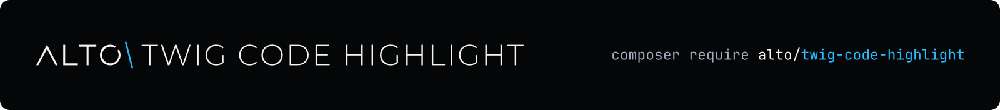

<h1 align="center">
  <a href="https://altophp.com/twig-code-highlight">
    
  </a>
</h1>

Highlight source code directly from Twig templates with a tag or filter powered
by [ALTO Code Highlight](https://github.com/altophp/code-highlight).

<p align="center">
  
  
  <a href="https://packagist.org/packages/alto/twig-code-highlight"></a>
  
  <a href="https://github.com/sponsors/smnandre"></a>
</p>

Use the block tag for source written in a template or the filter for source
provided by your application:

```twig

<?php echo 'Hello, Alto!';


{{ source|code_highlight('javascript') }}
```

## Installation

```bash
composer require alto/twig-code-highlight
```

The package requires PHP 8.4 or later, ALTO Code Highlight 1.x, and Twig 3.28
or later.

## Documentation

- [Installation](docs/installation.md)
- [Getting started](docs/getting-started.md)
- [Tag](docs/tag.md)
- [Filter](docs/filter.md)
- [Options](docs/options.md)

## Contributing

Contributions of all kinds are welcome. Visit the
[project on GitHub](https://github.com/altophp/twig-code-highlight) to
[report a bug](https://github.com/altophp/twig-code-highlight/issues/new),
[suggest a feature](https://github.com/altophp/twig-code-highlight/issues/new), or
[open a pull request](https://github.com/altophp/twig-code-highlight/pulls).

Before submitting code, run:

```bash
# Runs PHP CS Fixer, PHPStan, and PHPUnit
composer qa
```

Changes to public behavior should include tests and documentation.

## Support

ALTO Twig Code Highlight is open source and independently maintained by
[Simon André](https://smnandre.dev). If it is useful to your work, you can
support its continued development through
[GitHub Sponsors](https://github.com/sponsors/smnandre).

Sharing the package or
[starring it on GitHub](https://github.com/altophp/twig-code-highlight) also helps.

## License

ALTO Twig Code Highlight is released by [ALTO PHP](https://altophp.com) under the
[MIT License](LICENSE).
